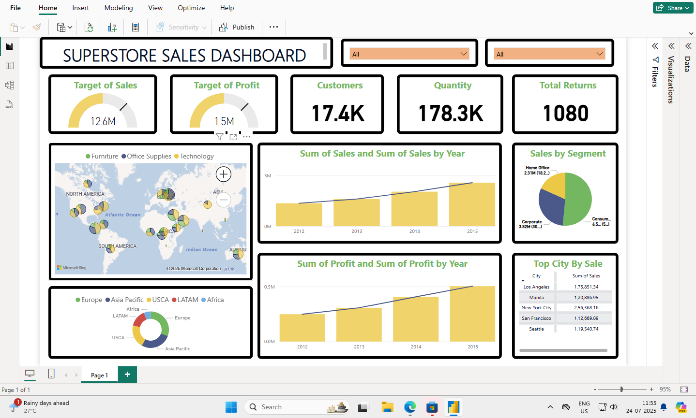

# PowerBi-Sales-Dashboard
Interactive Power BI dashboard for analyzing sales performance.

# 📊 Sales Dashboard (Power BI)

This Power BI dashboard provides actionable insights into sales performance across time, regions, and product categories. It is designed for business teams and stakeholders to make informed decisions quickly.

## 🖼 Dashboard Preview

## 📁 Files Included

- `Sales_Dashboard.pbix` – Power BI file with all visuals and DAX logic
- `dashboard_preview.png` – Screenshot of the dashboard

## 🔍 Key Features

- 📅 Monthly and yearly sales tracking  
- 🌍 Sales by region and segment  
- 📦 Top-selling products and categories  
- 💰 Profit margin analysis  
- 📈 Trend analysis and dynamic filters

## 🛠 Built With

- Power BI Desktop
- DAX
- SQL (for backend data preprocessing, if applicable)

## 📌 How to Use

1. Download `Sales Dashboard.pbix`
2. Open it using [Power BI Desktop](https://powerbi.microsoft.com/)
3. Explore the filters, visuals, and KPI insights

## 📫 Contact

- [LinkedIn](https://linkedin.com/in/sanskar-namdeo-3a4506254)
- Email: vanshnamdeo801@gmail.com
